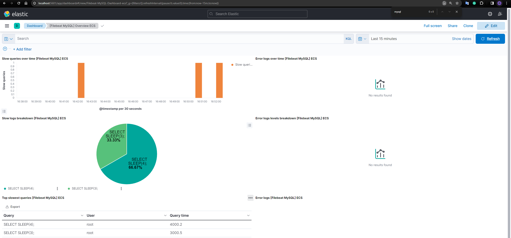

# MySQL Log Analysis with ELK and Graylog

This project sets up a Dockerized environment to capture and analyze MySQL slow query logs using both the ELK (Elasticsearch, Logstash, Kibana) stack and Graylog.

## Task Overview

- Set up a MySQL instance with slow query logging enabled.
- Configure ELK stack to work with MySQL slow query logs.
- Configure Graylog to work with MySQL slow query logs.

## Project Structure

```
/
├── docker-compose-filebeat-elk.yml       # Compose file for ELK stack setup
├── docker-compose-filebeat-graylog.yml   # Compose file for Graylog setup
└── filebeat/                             
    ├── filebeat.elk.yml                  # Filebeat configuration for ELK
    └── filebeat.graylog.yml              # Filebeat configuration for Graylog
```

## How to Run

### ELK Stack Setup

1. **Start Services (excluding Filebeat):**

   ```bash
   docker compose up --file docker-compose-filebeat-elk.yml -d
   ```

2. **Setup Filebeat (Index and Kibana Dashboard):**

   ```bash
   docker compose run --file docker-compose-filebeat-elk.yml -it filebeat setup
   ```

3. **Run Filebeat:**

   ```bash
   docker compose up --file docker-compose-filebeat-elk.yml -d filebeat
   ```

4. **Execute a Slow Query in MySQL:**

   ```bash
   docker compose exec --file docker-compose-filebeat-elk.yml -it mysql mysql --user=root --password=example --execute="SELECT SLEEP(3);"
   ```

5. **Result:**

   

### Graylog Setup

1. **Start Services (excluding Filebeat):**

   ```bash
   docker compose up --file docker-compose-filebeat-graylog.yml -d
   ```
2. **Run Filebeat:**

   ```bash
   docker compose up --file docker-compose-filebeat-graylog.yml -d filebeat
   ```

3. **Create Beats Input in Graylog Web Interface.**

4. **Execute a Slow Query in MySQL:**

   ```bash
   docker compose exec --file docker-compose-filebeat-graylog.yml -it mysql mysql --user=root --password=example --execute="SELECT SLEEP(3);"
   ```

5. **Result:**

   

## Accessing the Interfaces

- **Adminer**: Accessible at `http://localhost:8080`
- **Kibana**: Accessible at `http://localhost:5601` (for ELK setup)
- **Graylog**: Accessible at `http://localhost:9000` (for Graylog setup)

## Notes

- Ensure Docker is installed and running on your system.
- Adjust the MySQL, Filebeat, Elasticsearch, and Graylog configurations as necessary for your environment.
- The provided setup is intended for development or testing environments. Additional security and configuration considerations are needed for production deployment.

